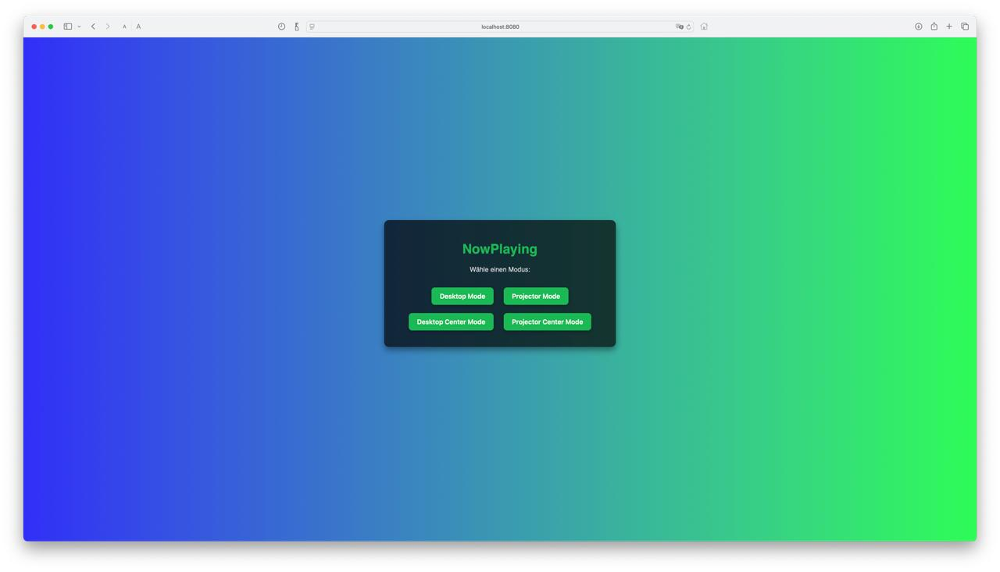
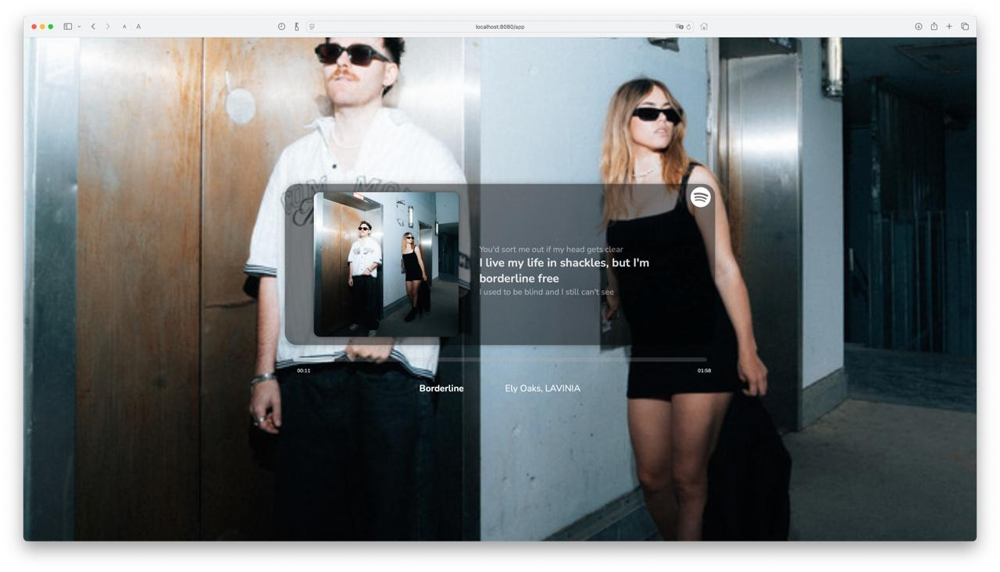
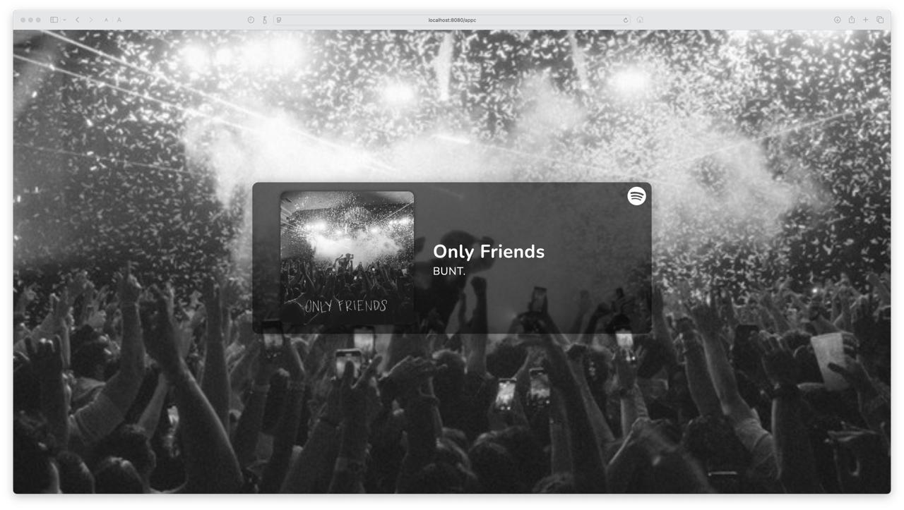
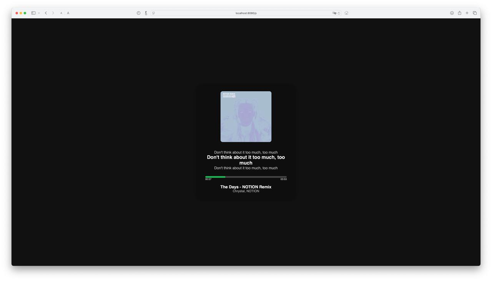
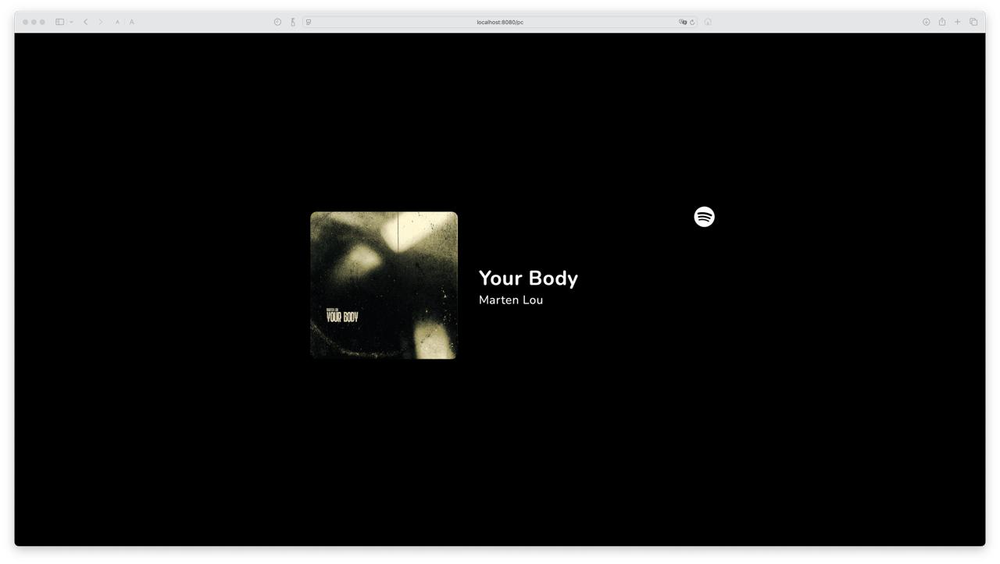
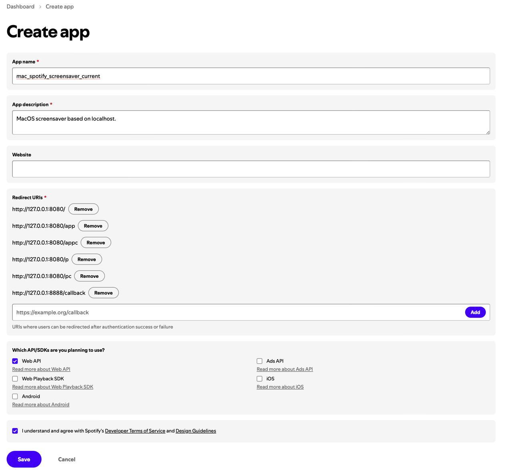
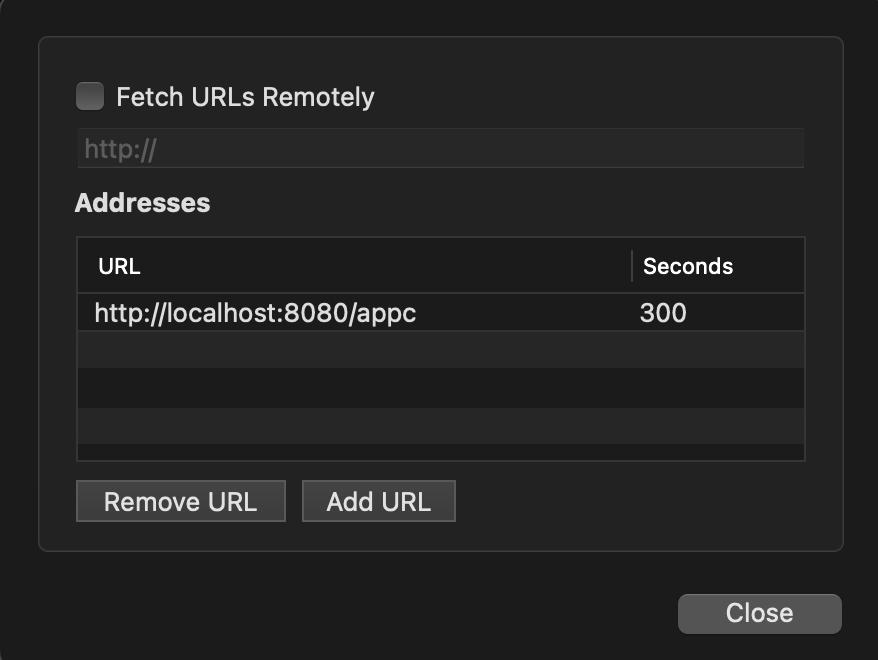

# mac_spotify_screensaver_current


A screensaver for macOS that displays your currently playing Spotify track, designed for use with [liquidx/webviewscreensaver](https://github.com/liquidx/webviewscreensaver).  
This project incorporates code from [@11ason/Spotify-Now-Playing](https://github.com/11ason/Spotify-Now-Playing), licensed under the MIT License.

---

## Preview

<table>
    <td align="center">
      <br>
       http://localhost:8080/ 
    </td>
    <td align="center">
      <br>
      http://localhost:8080/app
    </td>
  </tr>
  <tr>
    <td align="center">
      <br>
       http://localhost:8080/appc
    </td>
    <td align="center">
      <br>
       http://localhost:8080/p
    </td>
  </tr>
  <tr>
    <td align="center">
      <br>
       http://localhost:8080/pc
    </td>
    <td></td>
  </tr>
</table>

---

## 🎯 Purpose

This project allows you to **continuously** and **without user interaction** display your currently playing Spotify track on your  **screensaver**.

It solves a common problem:  
Spotify **access tokens expire after one hour**, and since OAuth login requires manual interaction, direct use of the Spotify Web API is not suitable for passive applications like screensavers or desktop projections.

---

## 🧩 The Idea

The solution consists of **two local servers**:

1. `spotify-proxy.js` (runs on `localhost:8888`)  
   → Handles Spotify login, stores and refreshes tokens, and exposes a simple API.

2. `server.js` (runs on `localhost:8080`)  
   → Serves the frontend interface (HTML overlay for a screensaver, desktop widget, etc.).

---

## 🔒 Why this is necessary

- Spotify OAuth requires **interactive login** — not possible in screensavers or locked desktops.
- Access tokens expire every 60 minutes.
- You can't use a permanent Spotify API URL (`https://api.spotify.com/...`) because the token expires.
- The desktop must be able to access the API **without login or clicks** — even while locked.
- This proxy provides a **static local endpoint** that handles all token logic internally.


---

## Features

- Shows current Spotify song info on your screensaver

- Supports autostart on macOS via launchd

---

## Setup

Also see in setup.txt

### 1. Install Dependencies

```sh
npm install express dotenv axios cors open
```

### 2. Spotify Developer Setup

1. Go to [Spotify Developer Dashboard](https://developer.spotify.com/dashboard) and create a new app.
2. Set the following Redirect URIs in your Spotify app settings:
    - `http://127.0.0.1:8080/app`
    - `http://127.0.0.1:8888/callback`
    - `http://127.0.0.1:8080/appc`
    - `http://127.0.0.1:8080/pc`
    - `http://127.0.0.1:8080/`
    - `http://127.0.0.1:8080/p`
  
   <td align="center">
      <br>
    </td>

### 3. Environment File

1. Fill out your credentials in the `.env.example` file.
2. Rename `.env.example` to `.env`.

### 4. Start the Servers

```sh
node server.js
node spotify-proxy.js
```

A browser window should open and ask you to log in to Spotify. After logging in, you should see a success message.

### 5. Test the Server

Go to [http://localhost:8080](http://localhost:8080) in your browser to check everything is working.

### 6. Install the Webview Screensaver

Download and install the latest release of [liquidx/webviewscreensaver](https://github.com/liquidx/webviewscreensaver).  
Follow their instructions to install it.

### 7. Configure the Screensaver

In the screensaver settings, add the desired URL(s):
- `http://localhost:8080/`
- `http://localhost:8080/app`
- `http://localhost:8080/appc`
- `http://localhost:8080/p`
- `http://localhost:8080/pc`

    <td align="center">
      <br>
    </td>

### 8. Set Up Autostart (macOS launchd)

Get the location of the files and add the path to the following XML code.
If you get an error, you may want to check the path of your node:
```
which node
```


#### For `server.js`:

1. Open Terminal and run:
    ```sh
    nano ~/Library/LaunchAgents/com.klehart.server.plist
    ```
2. Paste:
    ```xml
    <?xml version="1.0" encoding="UTF-8"?>
    <!DOCTYPE plist PUBLIC "-//Apple//DTD PLIST 1.0//EN"
     "http://www.apple.com/DTDs/PropertyList-1.0.dtd">
    <plist version="1.0">
    <dict>
        <key>Label</key>
        <string>com.klehart.server</string>
        <key>ProgramArguments</key>
        <array>
            <string>/usr/local/bin/node</string>
            <string>"YOUR_PATH HERE"/server.js</string>
        </array>
        <key>WorkingDirectory</key>
        <string>"YOUR_PATH HERE"</string>
        <key>RunAtLoad</key>
        <true/>
        <key>StandardOutPath</key>
        <string>/tmp/server.log</string>
        <key>StandardErrorPath</key>
        <string>/tmp/server-error.log</string>
    </dict>
    </plist>
    ```
3. Save (Ctrl+O, Enter, Ctrl+X).

#### For `spotify-proxy.js`:

1. Open Terminal and run:
    ```sh
    nano ~/Library/LaunchAgents/com.klehart.spotifyproxy.plist
    ```
2. Paste:
    ```xml
    <?xml version="1.0" encoding="UTF-8"?>
    <!DOCTYPE plist PUBLIC "-//Apple//DTD PLIST 1.0//EN"
     "http://www.apple.com/DTDs/PropertyList-1.0.dtd">
    <plist version="1.0">
    <dict>
        <key>Label</key>
        <string>com.klehart.spotifyproxy</string>
        <key>ProgramArguments</key>
        <array>
            <string>/usr/local/bin/node</string>
            <string>"YOUR_PATH HERE"/spotify-proxy.js</string>
        </array>
        <key>WorkingDirectory</key>
        <string>"YOUR_PATH HERE"</string>
        <key>RunAtLoad</key>
        <true/>
        <key>StandardOutPath</key>
        <string>/tmp/spotifyproxy.log</string>
        <key>StandardErrorPath</key>
        <string>/tmp/spotifyproxy-error.log</string>
    </dict>
    </plist>
    ```
3. Save (Ctrl+O, Enter, Ctrl+X).

   When experiencing issues after your mac goes to sleep, just add following:

   ```
   <key>KeepAlive</key>
    <true/>
   ```
   under the other:
   ```
   <key>RunAtLoad</key>
    <true/>
   ```


    


### 9. Restart your computer or log out/in to start the services.

##### When lyrics are kinda off, change the ```syncOffset``` in the html to make them more synchronous.

---

## Attribution

This project incorporates code from [@11ason/Spotify-Now-Playing](https://github.com/11ason/Spotify-Now-Playing), licensed under the MIT License.

---

## License

MIT License. See [LICENSE](LICENSE) for details.
